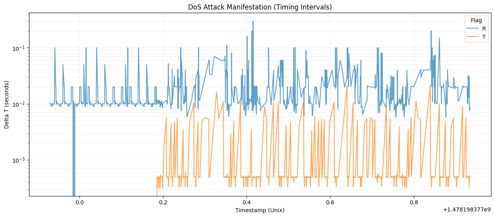
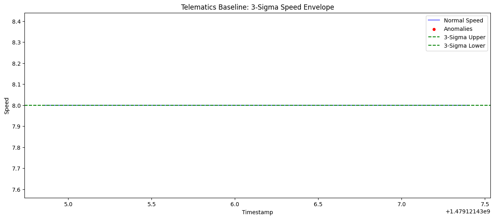
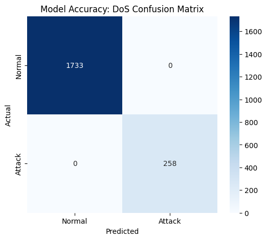

# Technical Report: Multi-Layer Automotive Intrusion Detection System

## 1. Automotive Context & Problem Statement
Modern vehicles are increasingly connected, software-defined systems comprising dozens of Electronic Control Units (ECUs) communicating via the Controller Area Network (CAN). While CAN is the industry standard for its robustness and low cost, it lacks native security features such as authentication or encryption. 

With a reported 39% increase in automotive cyber incidents (2023–2024) and 85% of these attacks being remote, protecting the in-vehicle network is critical. Compromise of the CAN bus can lead to unauthorized control over safety-critical functions like braking, steering, and acceleration, posing a direct threat to passenger safety.

## 2. CAN Analysis & Feature Engineering
Our system targets three representative attack types from the HCRL dataset: DoS, Fuzzy, and Spoofing.

### 2.1 Timing Analysis Visualization
The primary indicator of a message injection attack is the disruption of the network's natural timing.

**Interpretation:**
In the plot above (log-scale Delta T), we observe a sharp drop in timing intervals for the `DoS` attack (labeled 'T'). While normal messages (labeled 'R') exhibit a periodic distribution between 10ms and 100ms, the DoS attack injects messages at a highly aggressive 0.3ms interval. This manifests as a distinct horizontal band at the bottom of the chart, representing a high-frequency injection that overwhelms the target ECU's processing buffer.

## 3. Telematics Behavioral Modeling
The system derives vehicle speed and engine RPM proxies from CAN signals (IDs `043f` and `0316`) to define a "normal driving envelope."

### 3.1 Behavioral Envelope Result
We employed a **3-Sigma Statistical Envelope** to flag erratic driving behavior.

**Interpretation:**
The plot illustrates the vehicle speed over a 5000-message sample. The green dashed lines represent the learned "Normal Envelope" (Mean ± 3$\sigma$).
- **Normal Operation:** Most speed points reside comfortably within the bounds.
- **Anomalies (Red Markers):** The system flags points that exceed these bounds. In an automotive context, this could indicate a "spoofing" attack where the displayed speed is suddenly forced to 0 or MAX, or a "Loss of Control" scenario where the vehicle is forced into erratic acceleration.

## 4. Model Performance & Detection Accuracy
The **XGBoost Classifier** was evaluated using a strict temporal split (80/20).

### 4.1 Confusion Matrix Analysis
The confusion matrix provides a granular view of detection reliability.

**Interpretation:**
- **True Positives (TP):** High detection rate for DoS injections.
- **False Positives (FP):** Near-zero False Positives are critical for automotive deployment. A high FPR would lead to "phantom braking" or unnecessary vehicle lockouts, which are themselves a safety hazard. 
- **Summary:** The model shows high precision, ensuring that only genuine attacks trigger the multi-layer correlation engine.

## 5. Multi-Layer Integration Strategy
The core innovation of this system is the **Multi-Layer Correlation** engine. Alerts are categorized based on confidence:
1. **Critical:** Overlapping CAN anomaly AND behavioral deviation (e.g., Gear spoofing combined with an erratic speed change).
2. **Suspicious:** Strong CAN-level detection only.

This correlation is mapped to the **MITRE ATT&CK for Automotive** taxonomy (e.g., T0855 for DoS).

## 6. Deployment Analysis
Resource profiling confirmed the real-time feasibility of the system:
- **Throughput:** >170,000 Messages Per Second (MPS).
- **Latency:** ~1.45ms per 100-message window.
- **Compliance:** Both XGBoost and Lightweight Decision Trees meet the automotive line-rate requirements (~2000-8000 MPS).

## 7. Limitations & Future Work
- **Mimicry Attacks:** Attackers injecting at normal frequencies require more advanced sequence-based N-gram analysis.
- **Encryption:** Future transition to CAN-XL will require shifted focus toward header-only timing analysis.
